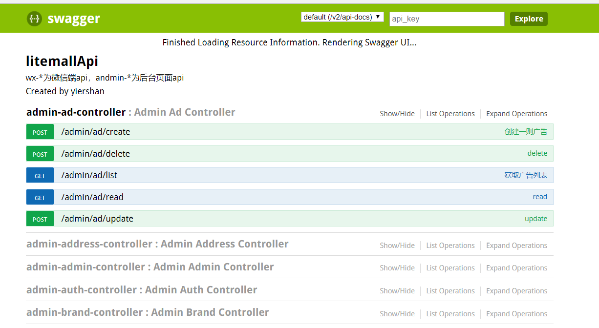

## 使用Swagger-Ui构建强大的RESTful API文档

### 添加引用

在pom.xml种 dependencies节点下添加

```$xslt
        <dependency>
            <groupId>io.springfox</groupId>
            <artifactId>springfox-swagger2</artifactId>
            <version>2.2.2</version>
        </dependency>
        <dependency>
            <groupId>io.springfox</groupId>
            <artifactId>springfox-swagger-ui</artifactId>
            <version>2.2.2</version>
        </dependency>
```

### 注入服务
在Application.java 同节点下添加Swagger2.java文件。

```$xslt
@Configuration
@EnableSwagger2
public class Swagger2 {

    @Bean
    public Docket createRestApi() {
        return new Docket(DocumentationType.SWAGGER_2)
                .apiInfo(apiInfo())
                .select()
                .apis(RequestHandlerSelectors.basePackage("org.linlinjava.litemall"))
                .paths(PathSelectors.any())
                .build();
    }

    private ApiInfo apiInfo() {
        return new ApiInfoBuilder()
                .title("litemallApi")
                .description("wx-*为微信端api，andmin-*为后台页面api")
                .termsOfServiceUrl("https://www.jianshu.com/u/8afb7e623b70")
                .contact("yiershan")
                .version("2.0")
                .build();
    }

}
```
### 添加注释

在对应的api上添加如下注译

```$xslt
@ApiOperation(value = "获取广告列表", notes = "获取广告列表分页数据")

    @ApiOperation(value = "创建一则广告",notes = "通过调用此方法可以创建一则广告")
    @ApiImplicitParams({
            @ApiImplicitParam(name = "adminId", value = "登陆用户id", required = true, dataType = "Integer"),
            @ApiImplicitParam(name = "ad", value = "广告内容对象", required = true, dataType = "json")
    })
```

